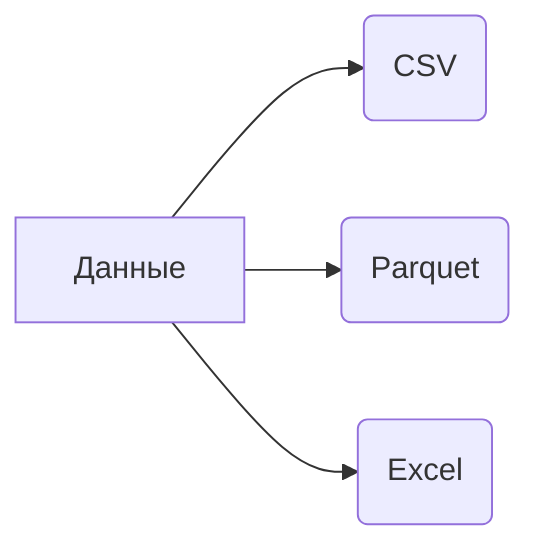

# 👩🏻‍💻 Log Analyzer - Анализатор логов веб-сервера с графическим интерфейсом

## 🌟 Основные возможности
🔍 1. Парсинг логов веб-серверов
- Поддержка форматов Apache/Nginx
- Автоматическое определение кодировки файлов (chardet)
- Обработка сложных строк логов через регулярные выражения
- Фильтрация дубликатов с помощью хеш-сумм записей

Пример шаблона для парсинга
```bash
LOG_PATTERN = r'^(?P<ip>\S+)\s+.*?"(?P<method>\w+)\s+(?P<api>\S+).*?(?P<status>\d{3})\s+(?P<bytes>\d+)'
```

🗄️ 2. Хранение данных в PostgreSQL
- Оптимизированная схема БД с индексами
- Материализованное представление daily_stats для аналитики
- Пакетная вставка данных (execute_batch, COPY)
- Поддержка пула соединений

Пример структуры БД:
```bash
CREATE TABLE requests (
    id SERIAL PRIMARY KEY,
    ip_id INTEGER REFERENCES ip_addresses(id),
    datetime TIMESTAMP WITH TIME ZONE NOT NULL,
    request_method VARCHAR(10) NOT NULL,
    status_code INTEGER NOT NULL,
    is_error BOOLEAN DEFAULT FALSE
);
```

📊 3. Визуализация данных
- Графики запросов по дням (matplotlib)
- Анализ ошибок (4xx/5xx) через круговые диаграммы
- Интерактивная таблица IP-адресов (QTableWidget)

Пример построения графика:
```bash
plt.bar(df['day'], df['total_requests'], color='skyblue')
plt.title("Количество запросов по дням")
```

📁 4. Экспорт данных
- CSV (через стандартный модуль csv)
- Parquet (оптимизированный для аналитики)
- Excel с автоформатированием (openpyxl)
- Автоматическое именование файлов с датой

Пример экспорта в Excel:
```bash
ws.column_dimensions[column].width = adjusted_width
wb.save("ip_stats_2023-11-15.xlsx")
```

⚡ 5. Оптимизации производительности
- Многопоточная обработка файлов (ThreadPoolExecutor)
- Кэширование IP-адресов
- Батчинг запросов к БД (до 500K записей за раз)
- Временное отключение WAL для массовых вставок

Настройки для быстрой вставки:
```bash
cursor.execute("SET synchronous_commit TO OFF")
cursor.execute("ALTER TABLE requests SET UNLOGGED")
```

🖥️ 6. GUI на PySide6
- Прогресс-бар обработки
- Кнопки для всех основных операций
- Отображение статистики БД
- Логирование действий в файл app.log

Пример элемента интерфейса
```bash
self.btn_export_csv = QPushButton("Экспорт в CSV")
self.btn_export_csv.clicked.connect(self.export_data)
```

🔄 7. Поддержка больших объемов
- Обработка файлов по частям
- Пропуск уже обработанных записей (хеш-проверка)
- Опциональная очистка БД перед новым импортом

Конфигурация:
```bash
CONFIG = {
    'max_batch_rows': 5_000_000,
    'max_workers': os.cpu_count() * 2
}
```

## 🛠️ Технологический стек

📦 Основные библиотеки
| Категория           | Библиотеки                           |
|---------------------|--------------------------------------|
| **GUI**             | PySide6 (Qt для Python)              |
| **Базы данных**     | psycopg2 (PostgreSQL), execute_batch |
| **Анализ данных**   | pandas, openpyxl                     |
| **Визуализация**    | matplotlib                           |
| **Парсинг**         | re (регулярные выражения), chardet   |
| **Многопоточность** | concurrent.futures (ThreadPool)      |

⚙️ Архитектурные решения
1. Многопоточная обработка:
```bash
with ThreadPoolExecutor(max_workers=CONFIG['max_workers']) as executor:
    futures = {executor.submit(process_file, fp): fp for fp in files}
```
2. Шаблон Producer-Consumer:
- Парсер (producer) → Очередь → Вставка в БД (consumer)
3. Оптимизация вставок:
- COPY FROM вместо INSERT
- Пакетная обработка (до 5M строк)

📊 Визуализация
- Динамические графики (matplotlib)
- Интерактивная таблица (QTableWidget)
- Экспорт в 3 формата:


🚀 Производительность
- Обработка:
1. До ~50K строк/сек на современном CPU
2. Пул соединений к PostgreSQL
- Оптимизации:
Отключаем WAL при массовой вставке
```bash
cursor.execute("ALTER TABLE requests SET UNLOGGED")
```

## Быстрый запуск
1. Установка зависимостей:
```bash
pip install -r requirements.txt
```
2. Установка и использование PostgreSQL:
- Установка интсаллятора с оф. сайта
- Указать пароль для суперпользователя (postgres)
- Подключение через psql -U postgres с вводом пароля(123) через cmd
- Создание БД и таблиц
```shell
-- Создать БД
CREATE DATABASE server_logs;
-- Подключиться к ней
\c server_logs
-- Создать таблицу (пример)
CREATE TABLE IF NOT EXISTS log_hashes (
    hash VARCHAR(64) PRIMARY KEY,
    processed_at TIMESTAMP DEFAULT NOW()
)
```
3. Запуск app.py в корневой папке:
```bash
py app.py
```
## 🎯 Производительность

| Компонент                 | Время обработки |
|---------------------------|-----------------|
| 1 лог                     | ~2.5-3 минуты   |
| Папка из 20 логов         | ~60 минут       |
| Экспорт в CSV и Parquet   | ~10 секунд      |
| Экспорт IP по дням(Excel) | ~7 секунд       |

## 📜 Лицензия
Этот проект распространяется под лицензией MIT.

---

<div align="center">
  <p>Разработано для Hackathon MIPT 2025</p>
  <p>© 2025 Команда разработчиков Дети-GPT</p>
</div>

